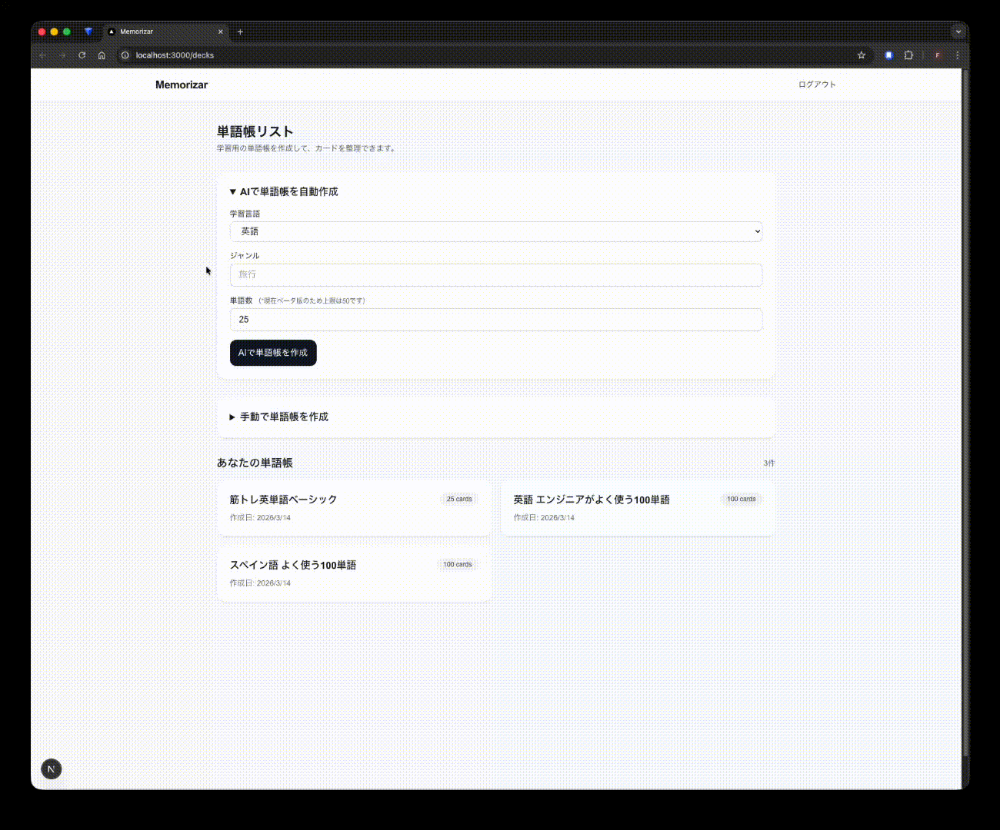

# Memorizar

Memorizar は、単語や知識を効率よく暗記するためのフラッシュカード学習アプリです。  
ユーザーは単語帳を作成し、その中に FlashCard（カード）を追加して学習できます。

カードは復習機能により、正解・不正解の履歴をもとに繰り返し学習できるようになっています。

また、OpenAI API を利用し、指定したテーマに基づいて単語帳を自動生成する機能を実装しています。

ユーザーが「旅行」や「エンジニア」などのテーマを入力すると、AI が関連する単語と意味を生成し、新しい単語帳として作成することができます。

この機能により、ユーザーはテーマを入力するだけで関連単語の単語帳を自動生成でき、学習準備の時間を大幅に短縮することができます。



---

# デモ

https://memorizar-alpha.vercel.app

## デモアカウント

email  
demo@example.com

password  
demo123456

---

# 主な機能

- ユーザー認証（Auth.js）
- 単語帳作成・管理
- Responses APIで単語帳の自動生成
- FlashCard の作成 / 編集 / 削除
- Deckごとの復習機能
- 苦手カードのみ復習するモード
- 学習履歴の保存
- 単語の発音を音声再生
- seedデータによるサンプル単語登録

---

# 使用技術

## フロントエンド

- Next.js（App Router）
- React
- TypeScript
- TailwindCSS

## バックエンド

- Next.js Server Actions
- Auth.js

## データベース

- PostgreSQL（Neon）

## ORM

- Prisma

## インフラ

- Vercel（デプロイ）
- Docker（ローカル開発）

## API
- OpenAI Responses API

---

# アーキテクチャ

```
Next.js (App Router)
        ↓
Server Actions
        ↓
Prisma ORM
        ↓
PostgreSQL (Neon)
```

---

# データベース設計

主なテーブル

- User
- Deck
- FlashCard
- FlashCardProgress
- ReviewHistory

```
User
 └ Deck
     └ FlashCard
         └ FlashCardProgress
```

---

# ローカル開発手順

## リポジトリをクローン

```
git clone https://github.com/fumiya-adachi/memorizar.git
cd memorizar
```

## Docker起動

```
docker compose up -d
```

## データベースマイグレーション

```
docker compose exec next npx prisma migrate dev
```

## seedデータの投入

```
docker compose exec next npx prisma db seed
```

---

# 今後の改善予定

- Deck共有機能
- モバイルUIの改善
- 学習統計ダッシュボード
- SRS（Spaced Repetition System）の導入
- Google Speech API を利用した高品質な音声読み上げ

---

# 作者

Fumiya Adachi

GitHub  
https://github.com/fumiya-adachi
